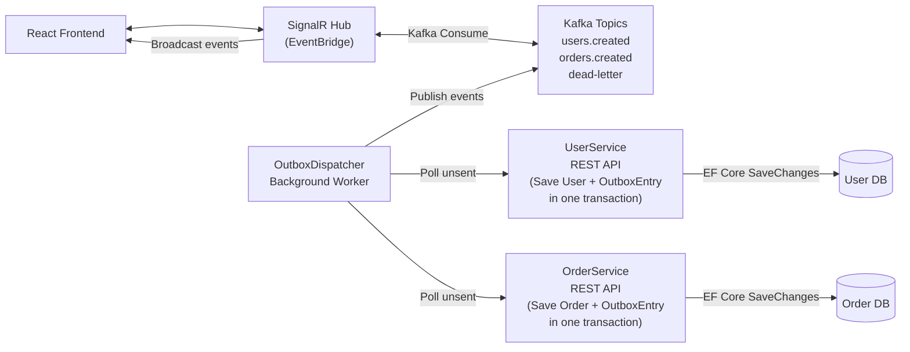
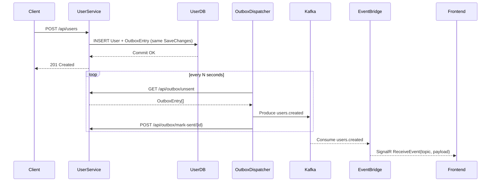
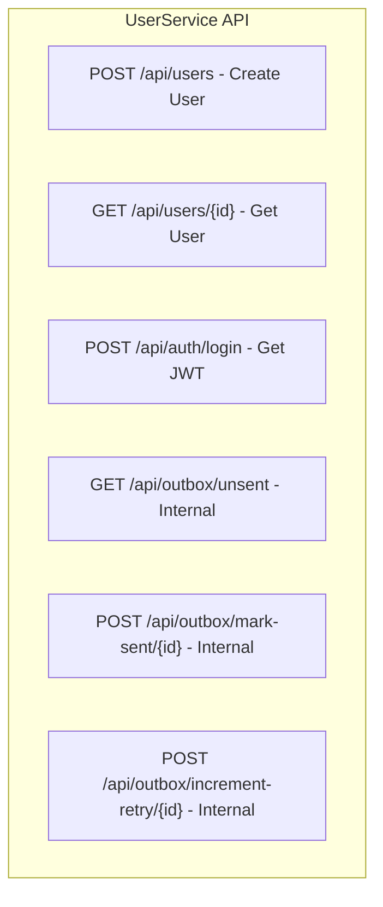

# Event-Driven Microservices Demo (User / Order / EventBridge)

This repository demonstrates a **reliable event-driven microservices architectures** built with **.NET, Kafka, SignalR, and React**, using the **Transactional Outbox pattern** to ensure consistency between database writes and event publishing.

The system allows creating **Users and Orders**, emitting domain events reliably to Kafka, and streaming those events live to a **React frontend** via **SignalR**.

---

## Table of Contents
- [Architecture Overview](#architecture-overview)
- [System Design](#system-design)
- [Event Flow](#event-flow)
- [Key Architectural Decisions](#key-architectural-decisions)
- [Technical Implementation](#technical-implementation)
- [API Design](#api-design)
- [Setup & Run Instructions](#setup--run-instructions)
- [Usage](#usage)
- [Testing Strategy](#testing-strategy)
- [Trade-offs & Future Improvements](#trade-offs--future-improvements)
- [Summary](#summary)

---

### Architecture Overview

**Goal**

> Create users and orders, emit events reliably, and display those events live in the UI.

#### High-Level Architecture


---

### System Design (C4-level Story)

#### Services
- UserService
-- REST API for user creation.
-- Writes User and OutboxEntry in a single EF Core transaction.
- OrderService
-- Same pattern as UserService for orders.
- OutboxDispatcher
-- Background worker that polls /api/outbox/unsent from services.
-- Publishes events to Kafka.
-- Marks events as sent.
- Kafka
-- Event backbone.
-- Topics: users.created, orders.created, dead-letter.
- EventBridge
-- Kafka consumer.
-- Broadcasts events to clients via SignalR.
- React Frontend
-- Connects to SignalR.
-- Displays live event streams.

---

### Event Flow

#### End-to-End Sequence


---

### Key Architectural Decisions

1. Transaction Outbox Pattern

**Why**
- Publishing directly to Kafka inside controllers risks lost or duplicated events if DB commits fail.
- Outbox ensures atomicity between state change and event creation.

**Result**
- At-least-once delivery.
- Consumers must be idempotent.

2. Dispatcher-Based Event Publishing

**Current**
- Central OutboxDispatcher polls services over HTTP.
- Simple to reason about and easy to demonstrate.

**Alternative (future)**
- Move dispatcher logic inside each service as a hosted background service.
- Fewer moving parts, no polling.

3. Event-Driven Communication
- Kafka decouples producers from consumers.
- Enables scaling, replay, and independent evolution.

---

### Technical Implementation

#### Modern .NET Practices
- Dependency Injection everywhere.
- BackgroundService for Kafka consumer and dispatcher.
- Environment-based configuration (Docker-friendly).
- Structured logging with context.
- CancellationToken usage for graceful shutdown.

---

#### .NET Core & EF Core

- Controllers persist domain entity + outbox record in one SaveChangesAsync.
- EF Core InMemory provider used for demo speed.

**Production upgrade**
- Replace InMemory with PostgreSQL (Npgsql).
- Add migrations and real transactional guarantees.

#### Ecosystem / Infrastructure

- Docker Compose spins up:
-- Kafka
-- Zookeeper
-- EventBridge
-- UserService
-- OrderService
-- React Frontend
- Kafka listener / advertised listener issues handled explicitly.
- OpenTelemetry hooks ready for distributed tracing.

---

### API Design 

#### UserService API 



#### OrderServiceAPI

- POST /api/orders
- GET /api/orders/{id}
- Same internal outbox endpoints.

**Design principle**

- Business APIs (users/orders) are separated from operational APIs (outbox).
- Outbox endpoints should be internal-only in production.

---

### Setup & Run Instructions

**Prerequisites**
- .NET 8 SDK
- Docker Desktop
- Git
- Node.js (optional for local frontend dev)

**Running the Application**

1. **Clone the project**:
   ```cmd
   git clone https://github.com/sumonnwe/microservice-ecommerce.git 
   ```

2. **Start everything with Docker Compose**:
   ```cmd
   docker-compose up --build
   ```

3. **Running Port**

| Service           | URL                                            |
| ----------------- | ---------------------------------------------- |
| Frontend          | [http://localhost:3000](http://localhost:3000) |
| EventBridge       | [http://localhost:5005](http://localhost:5005) |
| UserService       | [http://localhost:5001](http://localhost:5001) |
| OrderService      | [http://localhost:5002](http://localhost:5002) |
| OutboxDispatcher  | Background Worker Service                      |
| Kafka             | [http://localhost:9092](http://localhost:9092) |
| KafkaUI           | [http://localhost:8085](http://localhost:8085) |
 
4. **Usage** 
**Create a User**

```http
POST http://localhost:5001/api/users
Content-Type: application/json
Payload: {
  "name": "string",
  "email": "string"
}
``` 

**Create an Order**

```http
POST http://localhost:5002/api/orders
Content-Type: application/json
Payload: {
  "userId": "3fa85f64-5717-4562-b3fc-2c963f66afa6",
  "product": "test product",
  "quantity": 1,
  "price": 50
}
```

**Observe Events**

- Open [http://localhost:8085](http://localhost:8085) to view events produced by the UserService and OrderService.
- Open [http://localhost:3000](http://localhost:3000) to watch **Users Created** and **Orders Created** update live via **SignalR**, with events consumed from **EventBridge**.

---

### Testing Strategy

**Current**

Controller-level tests using EF Core InMemory and NUnit.

**Recommended Multi-Layer Strategy**

1. Unit tests
2. Integration tests
3. Contract tests
4. End-to-end smoke tests

**Unit Test Automation**

**Frameworks & Tools**

- NUnit – test framework
- Moq – mocking dependencies
- EF Core InMemory – fast persistence testing
- dotnet test – CI-friendly execution

**What Is Covered**

- Controller actions (success & validation failures)
- Application service logic
- Mapping and input validation
- Outbox record creation

**Running Unit Tests**

```cmd
dotnet test
```

**Example Test Scope**

- Create User → verifies User + OutboxEntry persisted
- Create Order → verifies Order + OutboxEntry persisted
- Invalid payload → returns correct HTTP status

**Future Test Improvements**

- Integration tests using WebApplicationFactory
- Kafka Testcontainers for message verification
- Contract tests for event schemas
- CI pipeline integration (GitHub Actions)

---

### Trade-offs & Future Improvements

#### Trade-offs

- **Polling vs Internal Dispatcher**

- Polling is simple and visible.
- Internal dispatcher is cleaner and more efficient.

- **At-least-once delivery**

- Possible duplicates → consumers must be idempotent.

- **Schema evolution**

- Versioned topics (users.created.v1) or schema version field.

#### Improvements

- Move dispatcher inside services.
- Add authentication to outbox endpoints.
- Add health/readiness probes.
- Add batching and exponential backoff.
- Introduce schema registry / JSON schema validation.

---

### Summary

This project demonstrates:

- Reliable event publishing with transactional outbox
- Event-driven microservices using Kafka
- Real-time UI updates with SignalR
- Clear separation of concerns and production-ready design trade-offs

