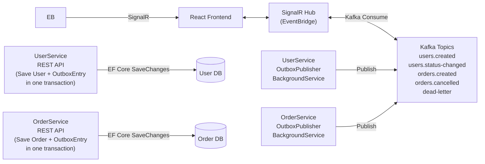
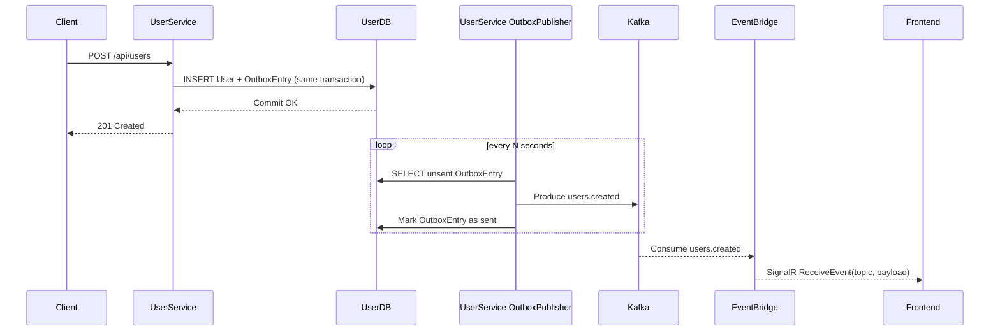
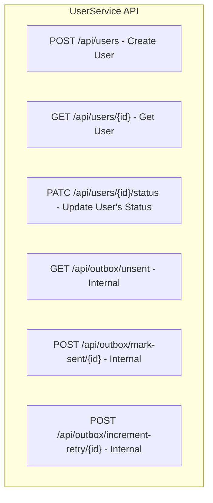
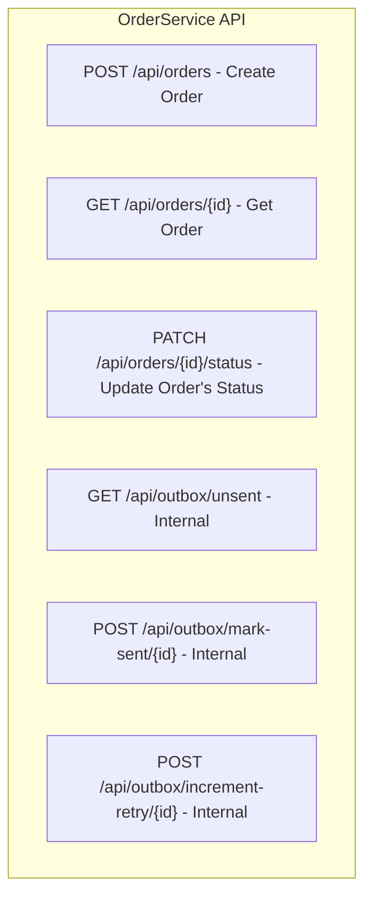

# Event-Driven Microservices Demo (User / Order / EventBridge)

This repository demonstrates a **reliable event-driven microservices architectures** built with **.NET, Kafka, SignalR, and React**, using the **Transactional Outbox pattern** to ensure consistency between database writes and event publishing.

The system allows creating **Users and Orders**, emitting domain events reliably to Kafka, and streaming those events live to a **React frontend** via **SignalR**.

---

## Table of Contents
- [Architecture Overview](#architecture-overview)
- [System Design](#system-design)
- [Event Flow](#event-flow)
- [Key Architectural Decisions](#key-architectural-decisions)
- [Technical Implementation](#technical-implementation)
- [API Design](#api-design)
- [Setup & Run Instructions](#setup--run-instructions)
- [Usage](#usage)
- [Testing Strategy](#testing-strategy)
- [Trade-offs & Future Improvements](#trade-offs--future-improvements)
- [AI Assistance & Prompt Documentation](#ai-assistance--prompt-documentation)
- [Summary](#summary)

---

### Architecture Overview

**Goal**

> Create users and orders, emit events reliably, and display those events live in the UI.

#### High-Level Architecture


---

### System Design (C4-level Story)

#### Services
- UserService
 -- REST API for user creation.
 -- Change user status (Active / Inactive)
 -- Writes User and OutboxEntry in a single EF Core transaction.

- OrderService
 -- Same pattern as UserService for orders.
 -- Subscribe to users.status-changed
 -- Cancel pending orders when user becomes inactive

- Outbox Publisher (In-Service)
 -- Runs as a BackgroundService inside each microservice
 -- Reads local Outbox table
 -- Publishes events to Kafka
 -- No HTTP polling, no central dispatcher

- Kafka
 -- Event backbone.
 -- Topics: users.created, orders.created, dead-letter, users.status-changed, orders.cancelled

- EventBridge
 -- Kafka consumer.
 -- Broadcasts events to frontend via SignalR.

- React Frontend
 -- Connects to SignalR.
 -- Displays live event streams.

---

### Event Flow

#### End-to-End Sequence


---

### Key Architectural Decisions


1. Event-Driven Microservices
- Services communicate via Kafka
- No synchronous coupling between UserService and OrderService
- Easy to add new consumers without changing producers

2. Outbox Pattern (In-Service Publisher)

**Why not a separate OutboxDispatcher service?**
- Removes tight coupling
- Fewer network hops
- No exposed /api/outbox/* operational endpoints
- Publishing scales naturally with each service

**Each service**
- Writes domain data + OutboxEntry in one transaction
- Publishes asynchronously via background worker

---

### Technical Implementation

#### Modern .NET Practices
- Dependency Injection everywhere.
- BackgroundService for Kafka consumer and dispatcher.
- Environment-based configuration (Docker-friendly).
- Structured logging with context.
- CancellationToken usage for graceful shutdown.

---

#### .NET Core & EF Core

- Controllers persist domain entity + outbox record in one SaveChangesAsync.
- EF Core InMemory provider used for demo speed.

**Production upgrade**
- API authentication/authorization.
- Replace InMemory with PostgreSQL (Npgsql).
- Add migrations and real transactional guarantees.

#### Ecosystem / Infrastructure

- Docker Compose spins up:
-- Kafka
-- Zookeeper
-- EventBridge
-- UserService
-- OrderService
-- React Frontend
- Kafka listener / advertised listener issues handled explicitly.
- OpenTelemetry hooks ready for distributed tracing.

---

### API Design 

#### UserService API 



#### OrderServiceAPI



**Design principle**

- Business APIs (users/orders) are separated from operational APIs (outbox).
- Outbox endpoints should be internal-only in production.

---

### Setup & Run Instructions

**Prerequisites**
- .NET 8 SDK
- Docker Desktop
- Git
- Node.js (optional for local frontend dev)

**Running the Application**

1. **Clone and navigate the project folder**:
   ```cmd
   git clone https://github.com/sumonnwe/microservice-ecommerce.git
   cd microservice-ecommerce
   ```

2. **Start everything with Docker Compose**:
   ```cmd
   docker-compose up --build
   ```

3. **Running Port**

| Service           | URL                                            |
| ----------------- | ---------------------------------------------- |
| Frontend          | [http://localhost:3000](http://localhost:3000) |
| EventBridge       | [http://localhost:5005](http://localhost:5005) |
| UserService       | [http://localhost:5001](http://localhost:5001) |
| OrderService      | [http://localhost:5002](http://localhost:5002) | 
| Kafka             | [http://localhost:9092](http://localhost:9092) |
| KafkaUI           | [http://localhost:8085](http://localhost:8085) |
 
4. **API Documentation**

**User Service**
[http://localhost:5001/swagger/index.html](http://localhost:5001/swagger/index.html)

**Order Service**
[http://localhost:5002/swagger/index.html](http://localhost:5002/swagger/index.html)

5. **Usage** 
**Create a User**

```http
POST http://localhost:5001/api/users
Content-Type: application/json
Payload: {
  "name": "string",
  "email": "string"
}
``` 

**Create an Order**

```http
POST http://localhost:5002/api/orders
Content-Type: application/json
Payload: {
  "userId": "3fa85f64-5717-4562-b3fc-2c963f66afa6",
  "product": "test product",
  "quantity": 1,
  "price": 50
}
```

**Observe Events**

- Open [http://localhost:8085](http://localhost:8085) to view events produced by the UserService and OrderService.
- Open [http://localhost:3000](http://localhost:3000) to watch **Users Created** , **Orders Created** , **Users Status Changed** , **Orders Cancelled** update live via **SignalR**, with events consumed from **EventBridge**.


---

### Testing Strategy

**Current**

Controller-level tests using EF Core InMemory and NUnit.

**Recommended Multi-Layer Strategy**

1. Unit tests
2. Integration tests
3. Contract tests
4. End-to-end smoke tests

**Unit Test Automation**

**Frameworks & Tools**

- NUnit – test framework
- Moq – mocking dependencies
- EF Core InMemory – fast persistence testing
- dotnet test – CI-friendly execution

**What Is Covered**

- Controller actions (success & validation failures)
- Application service logic
- Mapping and input validation
- Outbox record creation

**Running Unit Tests**

```cmd
dotnet test
```

**Example Test Scope**

- Create User → verifies User + OutboxEntry persisted
- Create Order → verifies Order + OutboxEntry persisted by validating user existence (id, status - active)
- Update User Status → triggers order cancellations
- Frontend SignalR connection → receives events (orders.created, users.created, users.status-changed, orders.cancelled)
- Invalid payload → returns correct HTTP status

**Future Test Improvements**

- Integration tests using WebApplicationFactory
- Kafka Testcontainers for message verification
- Contract tests for event schemas
- CI pipeline integration (GitHub Actions)

---

### Trade-offs & Future Improvements

#### Trade-offs and Assumptions

**Trade-offs**
- An in-memory database was selected to simplify setup and reduce external dependencies.
- This improves developer experience but sacrifices persistence and production realism.

**Assumptions**
- The system is intended for development and demonstration purposes.
- Data durability and high availability are not required.
- Load and traffic are minimal.

#### Improvements

**Embed the Outbox Dispatcher within each service**
 - Run the dispatcher as a background worker inside UserService and OrderService to reduce cross-service coupling and simplify deployment.

**Introduce authentication and authorization**
 - Secure API endpoints and Outbox processing with JWT-based authentication and role-based access control to prevent unauthorized access.

**Replace in-memory database with persistent storage**
 - Migrate to SQLite or PostgreSQL to enable data persistence, durability, and realistic production behavior.

**Add EF Core migrations**
 - Introduce schema migrations to support controlled database evolution and versioning across environments.

**Ensure transactional consistency**
 - Implement transactional record commits so domain data changes and Outbox entries are saved atomically within a single database transaction.

**Improve reliability and resilience**
 - Add retry policies, dead-letter handling, and structured logging for Outbox event publishing.

**Enhance observability**
 - Introduce correlation IDs, distributed tracing, and metrics to improve monitoring and debugging across services.

---

### AI Assistance & Prompt Documentation

This project was developed with the assistance of AI tools to accelerate scaffolding, 
validate architectural decisions, and improve code quality. 
All generated code was reviewed, adapted, and tested manually.

#### AI Tools Used
- **ChatGPT** – system design reasoning, architecture review, prompt refinement
- **GitHub Copilot** – project scaffolding, boilerplate generation, test skeletons

---

#### 1. Architecture & System Design Prompts

Used to design the microservices architecture, event-driven pattern, and clean code structure.

**Prompt (ChatGPT):**

Design a clean, testable microservices architecture using .NET 8, Kafka, and the Outbox pattern.
Focus on separation of concerns, dependency injection, and Docker-based orchestration.
Explain architectural decisions and trade-offs.

**Outcome:**
- Defined bounded contexts (UserService, OrderService, EventBridge)
- Selected Outbox pattern for reliable event publishing
- Established clean architecture folder structure per service

---

#### 2. Project Scaffolding Prompt

Used to generate a compile-ready solution skeleton.

**Prompt (GitHub Copilot Chat):**

Scaffold a solution template for an event-driven e-commerce system using .NET 8, Kafka,
EF Core with SQLite, Docker, React, and GitHub Actions.
Focus on folder structure, minimal stub code, and clean architecture.
Do not implement business logic.

**Outcome:**
- Generated solution and project structure
- Created placeholder controllers, DbContext, entities, and interfaces
- Ensured all projects build successfully before adding logic

---

#### 3. Database & EF Core Migration Prompts

Used to configure EF Core with an **in-memory database** for development and demonstration purposes.

**Prompt (ChatGPT):**

How should EF Core be configured for an event-driven .NET microservices system
using an in-memory database with User, Order, and Outbox entities,
while maintaining clean architecture and testability?

**Outcome:**
- Configured EF Core using the **In-Memory database provider**
- Modeled `User`, `Order`, and `OutboxEntry` entities for persistence
- Enabled the **Outbox Pattern** without external database dependencies
- Simplified local setup by removing the need for database migrations

---

#### 4. Docker & Environment Configuration Prompts

Used to debug Docker startup, port binding, and Swagger access issues.

**Prompt (ChatGPT):**

Swagger works in Visual Studio but not when running in Docker.
Explain common causes and provide a correct Docker and ASP.NET Core configuration.


**Outcome:**
- Fixed ASPNETCORE_URLS binding
- Disabled HTTPS redirection in containers
- Enabled Swagger for Docker environment

---

#### 5. Testing & CI/CD Prompts

Used to scaffold test projects and CI workflow.

**Prompt (GitHub Copilot):**

Generate NUnit test project scaffolding and a GitHub Actions workflow
to restore, build, and test .NET 8 microservices.


**Outcome:**
- Created NUnit test projects

---

#### Developer Responsibility Statement

AI tools were used as **assistive tools only**.
All code, configurations, and architectural decisions were:
- Reviewed manually
- Debugged locally and in Docker
- Adjusted to meet project requirements

Final responsibility for correctness, security, and maintainability
remains with the developer.

---

### Summary

This project demonstrates:

- Reliable event publishing with transactional outbox
- Event-driven microservices using Kafka
- Real-time UI updates with SignalR
- Clear separation of concerns and production-ready design trade-offs

